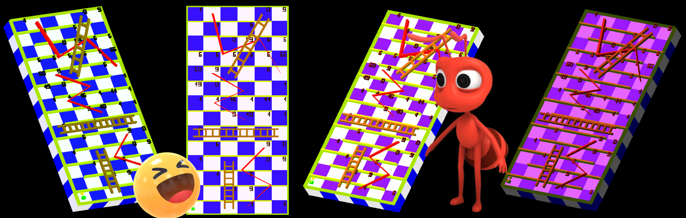

# 🎲 3D Ular Tangga dengan OpenGL & GLUT (C++)

## Penggunaan Di bawah y

Selamat datang di repositori game 3D Ular Tangga yang dibangun menggunakan OpenGL, GLUT, dan C++! Ini adalah implementasi modern dari permainan klasik dengan grafis 3D yang menarik.

🎮 Fitur Utama

🏗️ Papan permainan 3D dengan efek visual menarik

🐍 Ular dan tangga yang dibuat secara 3D

👥 Mode 2 pemain

🌈 Tema warna yang dapat disesuaikan

📥 Instalasi & Penggunaan
Prasyarat
Compiler C++ (g++/MinGW/Visual Studio)

OpenGL & GLUT terinstal

🖼️ Screenshot

  <!-- Format dasar -->

📜 Lisensi
MIT License - bebas digunakan dan dimodifikasi

🎮 Selamat Bermain! Semoga beruntung dalam perjalanan menaiki tangga dan hindari ular-ular licik! 🐍

Dibuat dengan ❤️ menggunakan OpenGL, GLUT, dan C++

#

V => 3D view

2x V => Side View

3x V => Normal View 2D

##

### In 3D View (V)

I => top rotation

K => bottom rotation

L => right rotation

J => left rotation

O => rotation turn to the right

U => rotation turn to the left

##

### In Side View (2x V)

arrow right left for rotate turn to the right or left

##

### In global

1 => change theme mode

2 => add lighting

3 => add more lighting (maybe)

##

### Gameplay

Press Space on ur kb to roll dice and enjoy the game